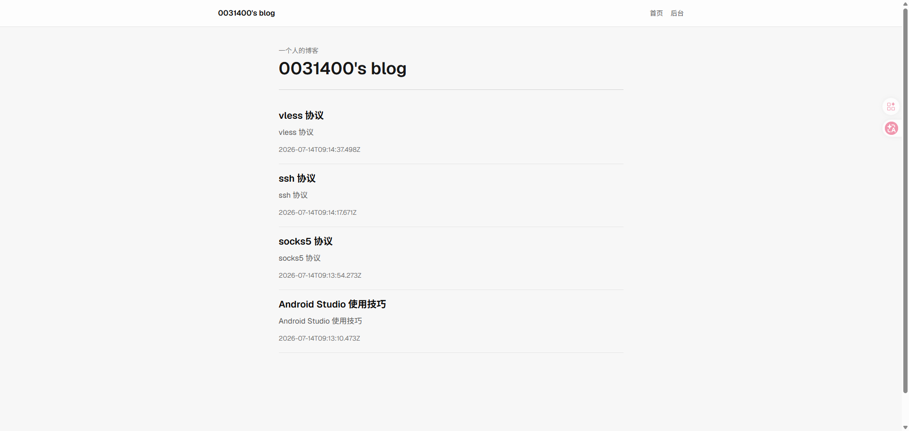
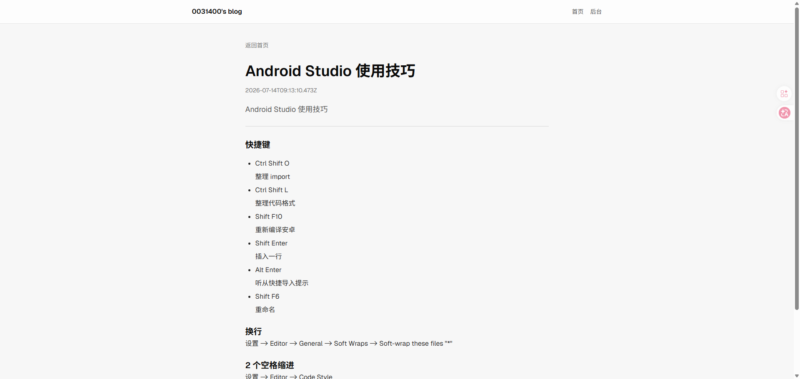
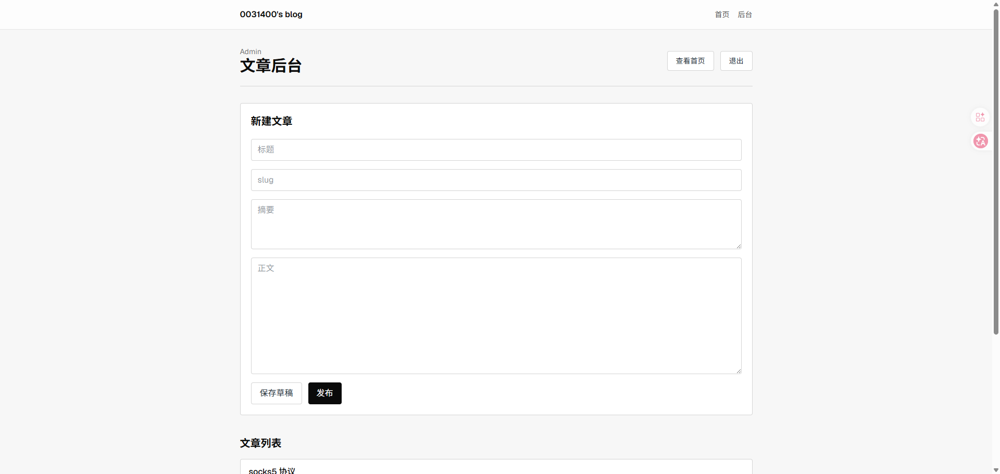
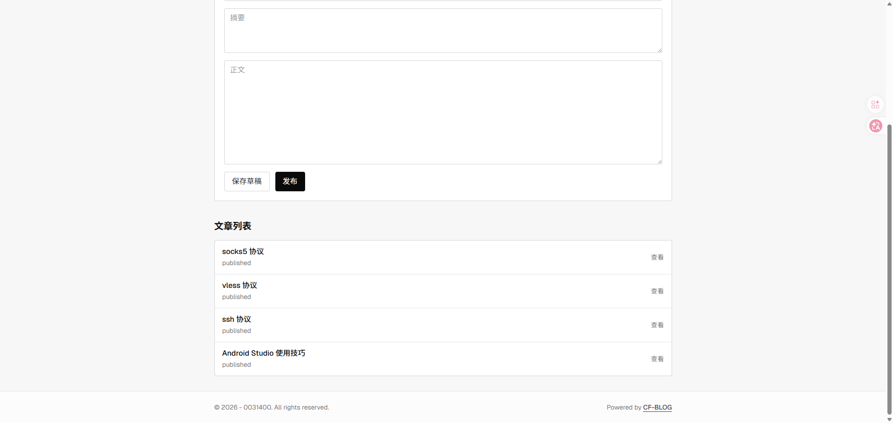
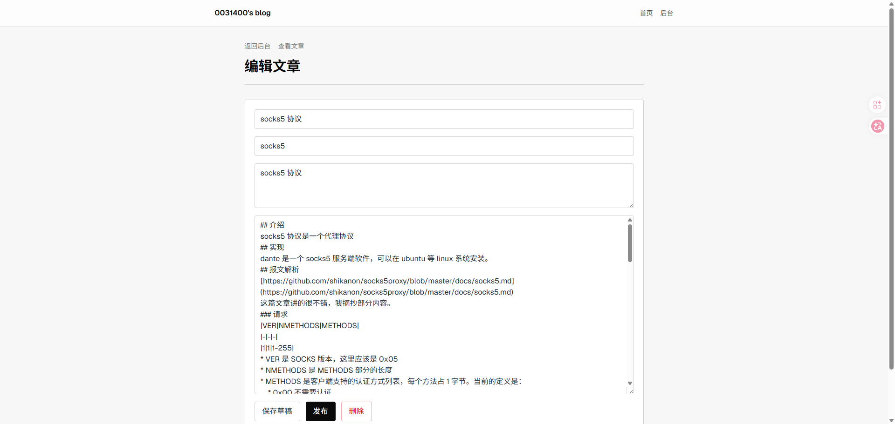
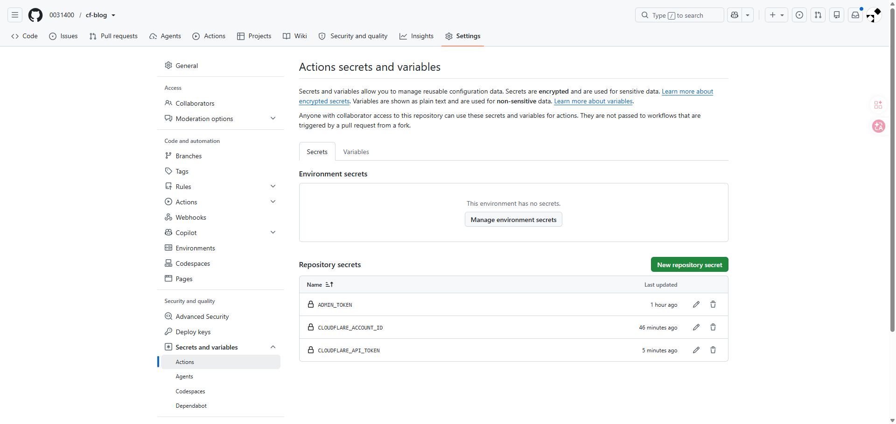
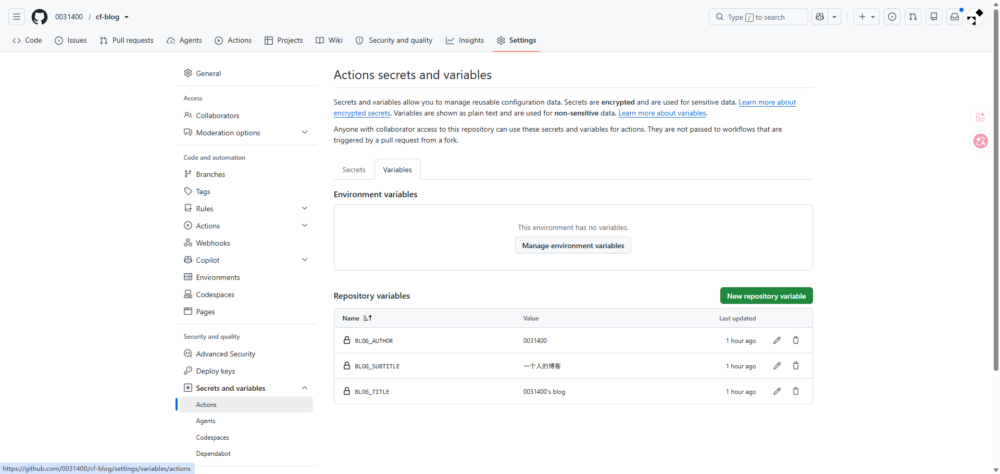
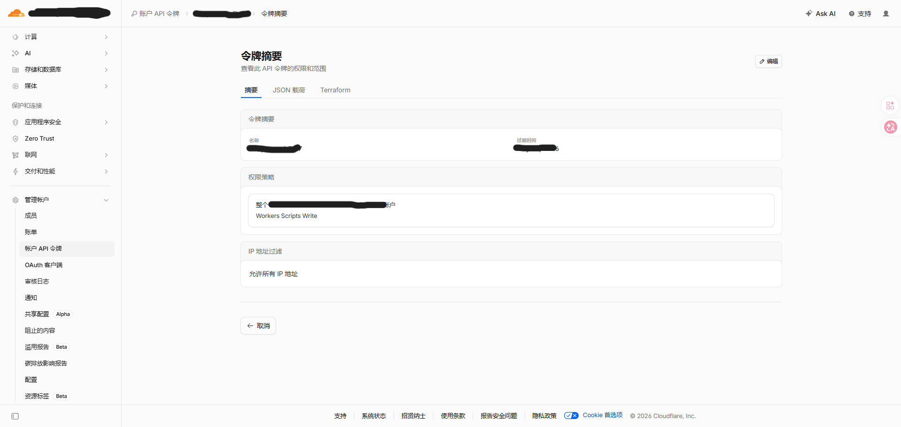

### 简介
一个运行在 cloudflare worker 使用 cloudflare d1 以 nextjs 为框架的简单个人博客
### 仓库
https://github.com/0031400/cf-blog
### 工作栈
- nextjs
- tailwindcss
### 功能
- 管理页面
- 分页
- markdown 渲染
- 局部刷新
### 图片





### 部署教程
#### 编辑 `wrangler.jsonc`
> 两种方法都需要修改这个文件

修改里面的 `d1_databases[0]` 的 `database_id` 和 `database_name` 为自己的 d1 数据库
#### linux 本地部署
> windows 的 opennextjs-cloudflare 暂时有问题

编写 `.env` 文件
```
ADMIN_TOKEN=123456
BLOG_TITLE="admin's blog"
BLOG_SUBTITLE="admin的博客"
BLOG_AUTHOR=admin
```
运行命令
```
yarn
yarn deploy
```
#### github workflow 部署
克隆到自己的仓库

设置 github action 变量
- ADMIN_TOKEN
- BLOG_TITLE
- BLOG_SUBTITLE
- BLOG_AUTHOR
- CLOUDFLARE_API_TOKEN
- CLOUDFLARE_ACCOUNT_ID



> 需要账号 `api令牌` ，而不是 `用户api令牌`

